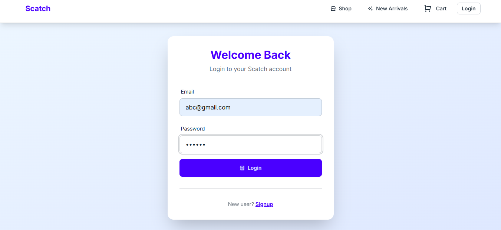
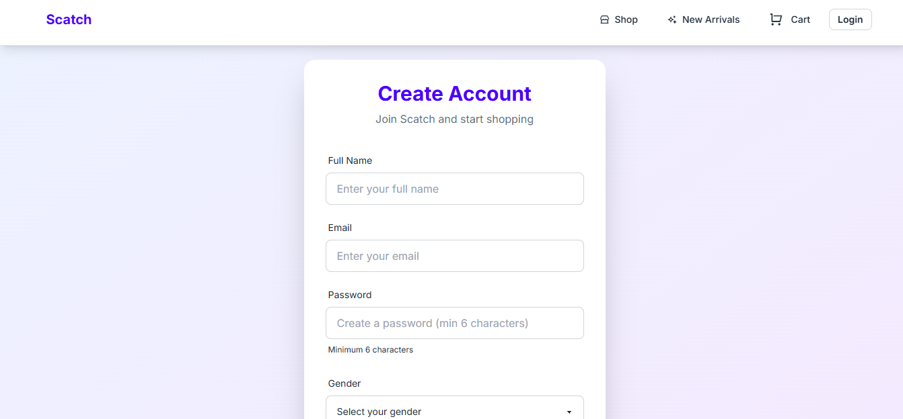
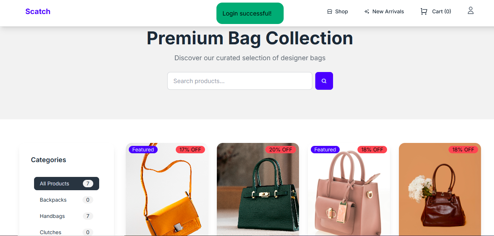
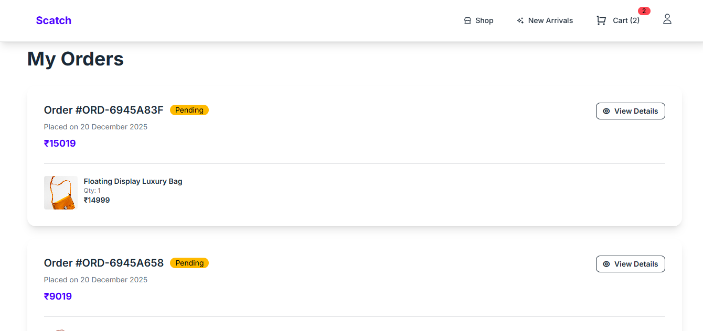
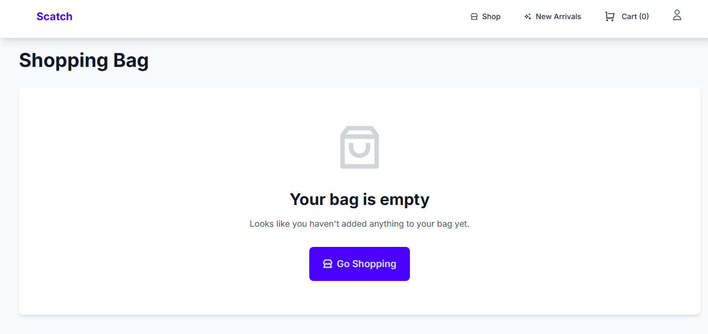
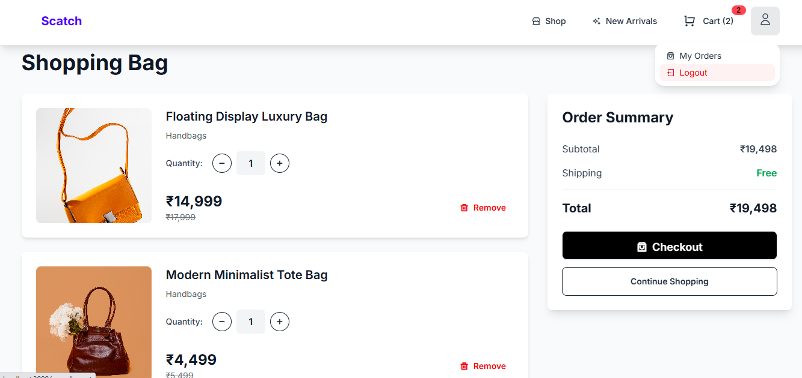

👜 Scatch — Full-Stack E-Commerce Web App

A production-ready full-stack e-commerce application for shopping bags, built with secure authentication, dynamic product rendering, and session-based cart management.

📌 Overview

Scatch is a full-stack e-commerce web application that replicates real-world online shopping workflows.
It focuses on backend robustness, session-based authentication, and server-side rendering using EJS.

Users can register, log in, browse products, view product details, add items to a cart, and maintain session state across pages.

🚀 Features

🔐 Authentication – Secure register/login with express-session

🛍️ Product Listing – Dynamic shop & product detail pages

🛒 Cart System – Session-based add/remove cart functionality

🧭 Protected Routes – Auth-aware navigation & redirects

🌐 SSR UI – Server-side rendering with EJS

🖼️ Screenshots
Authentication

   

Shop & Orders

    

Cart

   

🛠️ Tech Stack

Frontend: EJS, Tailwind CSS

Backend: Node.js, Express.js

Database: MongoDB Atlas, Mongoose

Auth: Express Sessions

▶️ Run Locally
git clone https://github.com/dipanshi8/Scatch.git
cd Scatch
npm install

PORT=3000
MONGO_URI=your_mongodb_atlas_uri
SESSION_SECRET=your_secret

npm start

Open:

http://localhost:3000

👩‍💻 Author

Dipanshi Yadav
GitHub: https://github.com/dipanshi8

LinkedIn: https://www.linkedin.com/in/dipanshi-yadav-00081b